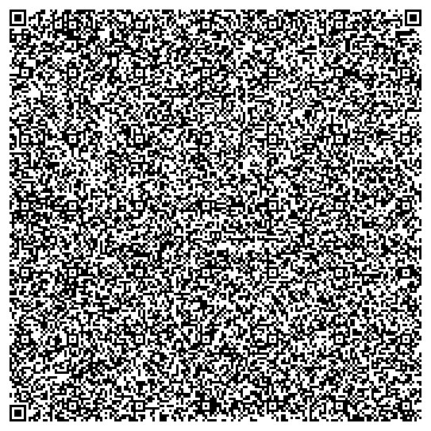

# Phys222-Magnets
Code for simulation and related images.

Uses the [uv](https://github.com/astral-sh/uv) project to set up a python virtual environment.

Both the QR code and PDF contain the python code. I just thought making a QR code would be funny.

QR Code of [main.py](magnets/main.py)

